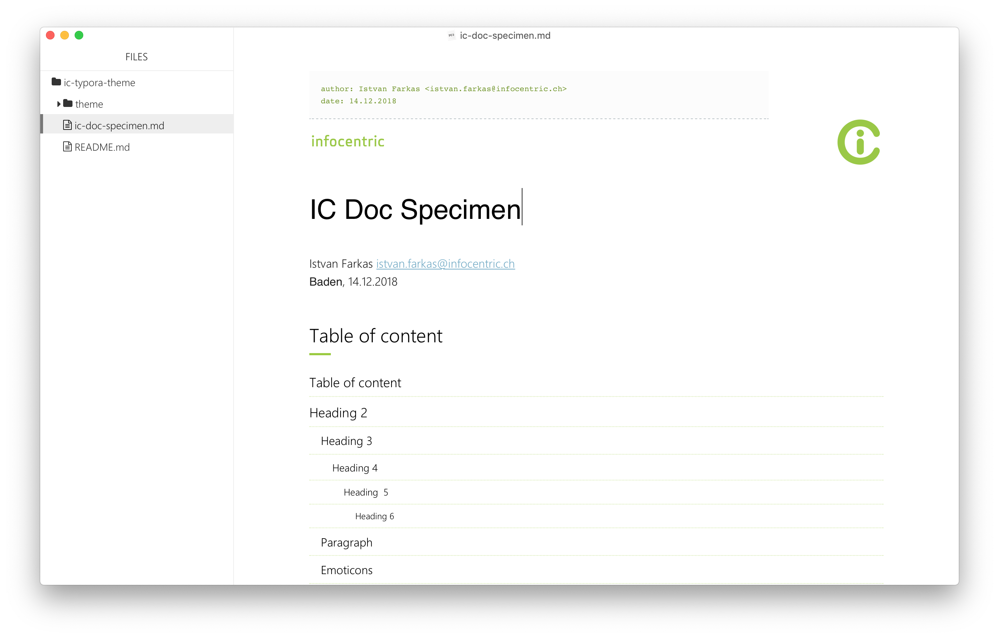
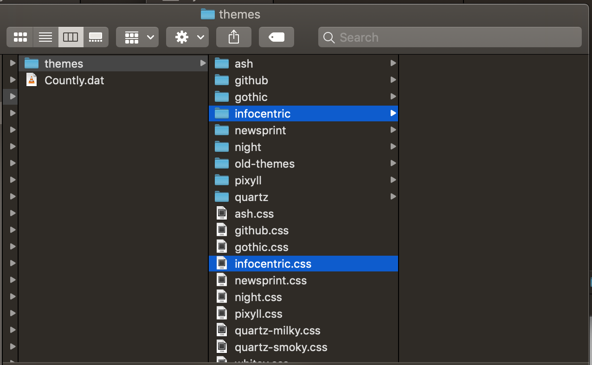

[](releases/latest)
[](http://opensource.org/licenses/MIT)
# ic-typora-theme

A corporate Infocentric theme for the [Typora](https://typora.io/) free inline markdown editor.



## Motivation

Because I'm so used to write markdown in my Jira tickets, confluence and README files, I write all my notes, reminders, tutorials, documentation and alike in markdown with [**Typora**](https://typora.io/).

And it hurts me quite deeply when I have to share a document with a customer and have to rewrite my text in Word or any other text processing software. Also I think it's important to deliver nice and professional-looking corporate documents to our customers or partners.

However, it should be quick and easy to do and [**Typora**](https://typora.io/), which is one of the rare free, cross-platform and full-featured markdown editors out there, provides a very useful HTML/CSS-based theming engine.

So, here it is: a corporate Infocentric theme make your markdown documents look nice and professional.

Of course, [PDF export](./assets/ic-doc-specimen.pdf) is supported as well.

## Examples

Please have a look in the [examples](./examples) folder for some sample markdown documents.

## Installation

1. Install Typora from https://typora.io/
2. Open Typora and select the `Preferences` menu:
   - On mac: `Typora > Preferences`
   - On WIndows: `File > Preferences`
3. Click the "Open Theme Folder" button: the `themes` folder opens in your file system
4. Download the latest release [ic-typora-theme.zip](.//ic-typora-theme/releases/latest) and copy its content to Typora's `themes` folder
5. You should have the `infocentric.css` file and the `infocentric folder` lying next to the other themes' CSS files and folders:

   

6. Restart Typora to activate the newly installed theme
7. In the `Themes` menu, choose `Infocentric`
8. Check the [instructions on Typora's website](https://theme.typora.io/doc/Install-Theme/) for more information

### Note about `Heading 1`

Please note that the theme assumes you have exactly one `Heading 1` at the beginning of your document which is the document's title. The header containing IC logos is applied to this element.

### Note about IC corporate font

You must have the Malgun font installed on your system for the theme to be complete. Infocentric employees should have it already installed on their machines. If that's not the case, please contact your Chief Marketing Officer 😋

The `Malgun Gothic` font family can be found on Microsoft's font library: https://docs.microsoft.com/en-us/typography/font-list/malgun-gothic

## Contribute

### Build zip on pre-commit

You can link the `pre-commit.sh` script to your local pre-commit hooks so that it automatically updates the zip file when a change occurs:

```bash
$ cd ic-typora-theme
$ ln -s ../../pre-commit.sh .git/hooks/pre-commit
```

For now, the script is dumb and updates the zip for every change done in a commit. Ideally you should only do it when a file changed in the `theme` folder. Also, there is no Windows version of the script...

### Questions or feature request

Contact [istvan.farkas@infocentric.ch](mailto:istvan.farkas@infocentric.ch)

PRs welcome !